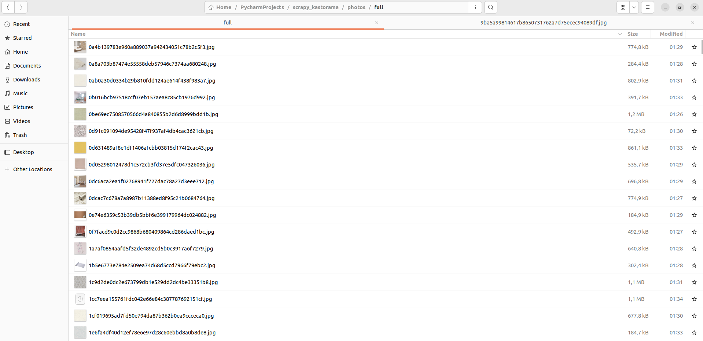

<h1>Парсинг сайта castorama.ru</h1>
<strong>Парсинг товаров с сайта castorama.ru с вводом поискового запроса пользователем. Каждый поисковый запрос обрабатывается отдельно и записывается в отдельную коллекцию.</strong>
Собираемые данные:
<ul>
	<li>Название товара - переменная name</li>
	<li>Цена - переменная price</li>
	<li>Валюта - переменная price_currency</li>
	<li>Фотографии - переменная photos</li>
	<li>Артикул/код товара - переменная sku</li>
	<li>Гиперссылка на страницу товара - переменная url</li>
</ul>

## Установка и запуск

Для корректной работы паука вам потребуется:
<ul>
	<li>MongoDB 6.0.4 Community</li>
	<li>PyCharm 2022.3.2 (Community Edition) с установленным интерпретатором Python 3.10</li>
	<li>Установленный модуль Scrapy</li>
	<li>Установленный модуль PyMongo</li>
</ul> 


```pip install scrapy```

```pip install pymongo```

### Запуск
Запуск паука осуществляется только с помощью файла runner.py.

Из корневой папки проекта командой в терминале:

```python runner.py```

Либо запуск из программы PyCharm.

```Ctrl+Shift+F10```

## Структура проекта

<ul>
	<li>scrapy_kastorama/runner.py - запуск паука, ввод поискового запроса</li>
	<li>scrapy_kastorama/ks_parser/settings.py - файл настроек паука</li>
	<li>scrapy_kastorama/ks_parser/pipelines.py - получение и сохранение данных</li>
	<li>scrapy_kastorama/ks_parser/items.py - обработка полученных данных</li>
	<li>scrapy_kastorama/ks_parser/spiders/castoramaru.py - скрипт паука, сбор данных</li>
</ul>


## Сохранение данных

	
Данные сохраняются в базу данных MongoDB - kastorama_db. Каждый поисковый запрос сохраняется в отдельную коллекцию.


Фотографии сохраняются в папке Photos. 




## Примеры запросы к базе данных 
	
### Пример запроса к базе данных из терминала
СКРИНШОТ
	
### Пример запроса к базе данных python
СКРИНШОТ
```
# на примере предварительно созданной коллекции "обои"

from pymongo import MongoClient
from pprint import pprint

client = MongoClient('mongodb://localhost:27017/')
db = client.castorama_db

collections = db.list_collection_names()
for col in collections:
    print("Collection: {}\n".format(col))
info = db.обои.find_one()
pprint(info)
```

